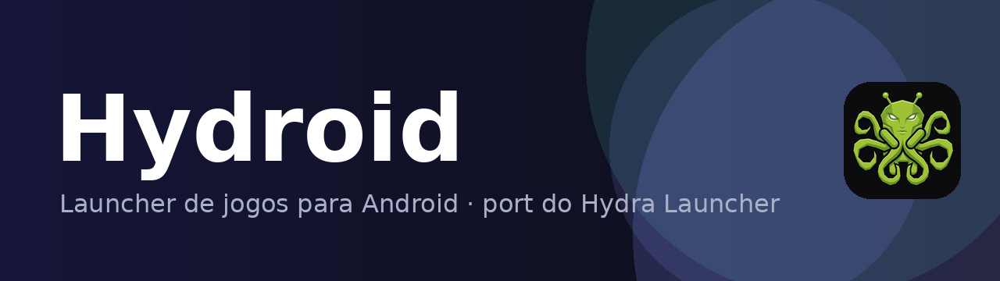

  

  
  
  
  
  
  

  <b>Hydroid</b> é um port Android não-oficial do <a href="https://github.com/hydralauncher/hydra">Hydra Launcher</a>, 
  escrito em Kotlin nativo com Jetpack Compose. Projeto de estudo, sem afiliação com o Hydra Launcher.

## Baixar

APK universal assinado (arm64 + x86_64):

➡️ [**Hydroid v0.8 — Releases**](https://github.com/DuduSync/Hydroid/releases/latest)

## Funcionalidades

- Busca de jogos na Steam com capas e detalhes (descrição em PT-BR)
- Página do jogo imersiva: arte em tamanho cheio, sem barras, botão de voltar minimalista
- **Conta Hydra**: login, sincronização da biblioteca e das fontes
- Perfil da conta: visibilidade do perfil e dos souvenires, presentes na nuvem, bloqueados, segurança e assinatura do Hydra Cloud
- Fontes de download registradas via **Hydra Cloud** — o servidor do Hydra resolve as fontes atrás de Cloudflare automaticamente
- Repacks por jogo com **método de download explícito**:
  - **Real-Debrid** — torrents e hosters processados no cloud
  - **Premiumize, AllDebrid e TorBox** — alternativas em beta (com aviso no app)
  - **Torrent** — engine nativa (libtorrent4j) direto no aparelho, com peers, seeds e trackers públicos automáticos
  - **Direto** — download HTTP direto, sem precisar de conta (quando a fonte oferece link de arquivo real)
- **Link manual**: cole um magnet ou URL direta na página do jogo pra baixar o que quiser
- Downloads com progresso, velocidade, ETA e badge do método utilizado
- **Pausar e continuar**: retoma de onde parou, mesmo depois de fechar o app
- **Fila de downloads** com limite de simultâneos (1, 2, 3 ou sem limite)
- **Só baixar no Wi-Fi** e **limite de velocidade** por download
- Cancelar um download apaga o arquivo parcial (sem lixo no armazenamento)
- Notificação de progresso em primeiro plano (foreground service)
- Pós-download: **extração automática** de `.zip`/`.rar`, **abrir pasta**, extrair manualmente e apagar (removendo só o que aquele download criou)
- Pasta de download escolhida por você (via SAF), configurável a qualquer momento
- Setup guiado em 4 passos (notificações, otimização de bateria, acesso a arquivos e pasta de downloads)
- **Atualização automática**: confere o release mais recente e instala o APK com um toque
- Ajustes organizados em submenus (Integrações, Fontes, Configurações, Logs e Créditos), com validação das chaves dos serviços debrid
- Logs internos com exportação para diagnóstico
- **Limpar cache** com um toque (imagens e temporários, sem tocar nos downloads)
- Biblioteca local com capas
- **Interface em português e inglês** (seletor de idioma nas configurações)
- Sair com dois toques no voltar (com aviso na tela)
- Temas claro e escuro (Material 3)

## Como usar

1. Na primeira abertura, conclua o setup (notificações, bateria, acesso a arquivos e pasta de downloads)
2. (Opcional) Em **Ajustes → Integrações**, configure sua chave do Real-Debrid (ou outro serviço debrid) — sem ela dá pra baixar via Torrent ou Direto
3. Em **Ajustes → Fontes de download**, adicione fontes de download (URLs de catálogo `.json`, formato Hydra)
4. Em **Catálogo**, busque um jogo e abra a página dele
5. Escolha um repack e toque em **Baixar** — depois escolha o método (Real-Debrid, Torrent ou Direto)
6. Acompanhe em **Downloads** — por padrão os jogos vão para `/storage/emulated/0/Download/HYDROID` (configurável em **Ajustes → Configurações do app**)

## Real-Debrid

  

  Assine pelo <a href="http://real-debrid.com/?id=11384117">link de convite</a> e apoie o projeto

O Real-Debrid é o motor recomendado de downloads: ele processa torrents e hosters no cloud e devolve um link direto de alta velocidade para o aparelho. Pegue sua chave em [real-debrid.com/apitoken](https://real-debrid.com/apitoken) e cole em **Ajustes → Integrações**.

## Aviso legal

O Hydroid não hospeda, indexa nem distribui nenhum conteúdo. As fontes de download são configuradas pelo próprio usuário e os downloads acontecem a partir delas. Baixe apenas conteúdo que você tem o direito de baixar. Marcas e jogos citados pertencem aos seus respectivos donos.

## Créditos

- [Hydra Launcher](https://github.com/hydralauncher/hydra) — projeto original (MIT); grande parte da lógica, das APIs e do ecossistema de fontes vem dele
- Port Android por [DuduSync](https://github.com/DuduSync)

## Apoie o projeto

Se o Hydroid te ajuda, considere apoiar o desenvolvimento via Pix:

  

## Licença

[MIT](LICENSE)
