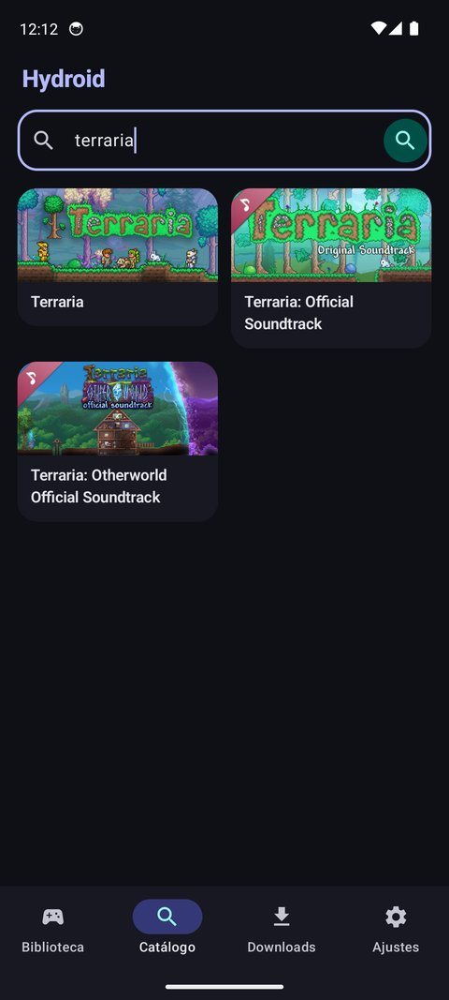
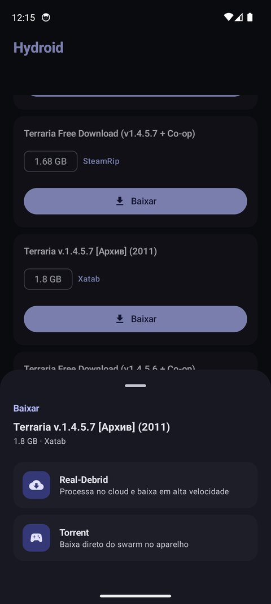
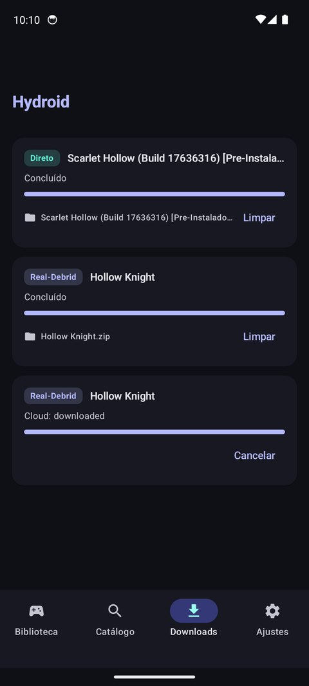
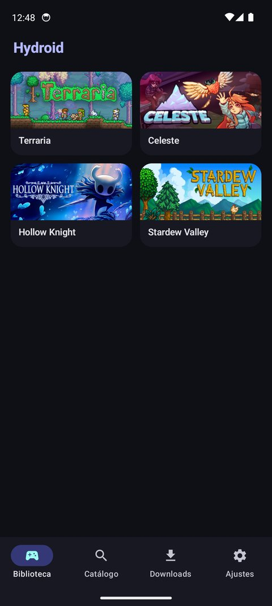
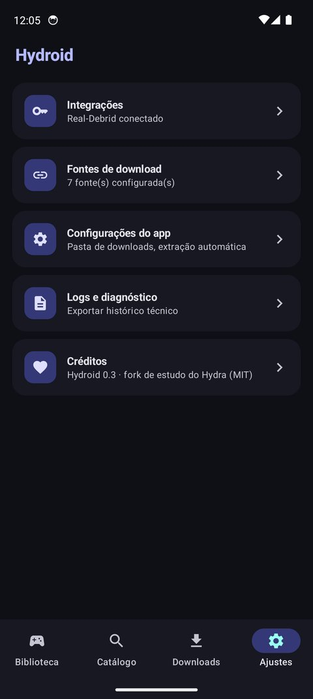
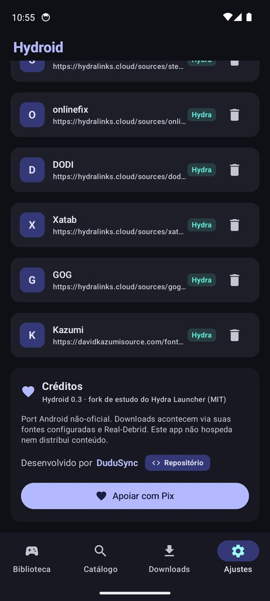

<p align="center">
  
</p>

<p align="center">
  
  
  
  
</p>

<p align="center">
  <b>Hydroid</b> é um port Android não-oficial do <a href="https://github.com/hydralauncher/hydra">Hydra Launcher</a>,<br/>
  escrito em Kotlin nativo com Jetpack Compose. Projeto de estudo, sem afiliação com o Hydra Launcher.
</p>

## Screenshots

| Catálogo | Repacks e métodos | Downloads | Biblioteca |
| :---: | :---: | :---: | :---: |
|  |  |  |  |

## Funcionalidades

- Busca de jogos na Steam com capas e detalhes (descrição em PT-BR)
- Fontes de download registradas via **Hydra Cloud** — o servidor do Hydra resolve as fontes atrás de Cloudflare automaticamente
- Repacks por jogo com **método de download explícito**:
  - **Real-Debrid** — torrents e hosters processados no cloud
  - **Direto** — download HTTP direto, sem precisar de conta (quando a fonte oferece link de arquivo real)
  - **Torrent** — em breve (engine local)
- Downloads com progresso, velocidade e badge do método utilizado
- Biblioteca local com capas
- Temas claro e escuro (Material 3)

## Como usar

1. Em **Ajustes**, configure sua chave da API do Real-Debrid
2. Ainda em **Ajustes**, adicione fontes de download (URLs de catálogo `.json`, formato Hydra)
3. Em **Catálogo**, busque um jogo e abra a página dele
4. Escolha um repack e toque em **Real-Debrid** ou **Direto**
5. Acompanhe em **Downloads** — os arquivos ficam em `Android/data/gg.hydroid.app/files/Downloads`

<p align="center">
  
</p>

### Fontes de download

O formato é o mesmo do Hydra:

```json
{
  "name": "Minha fonte",
  "downloads": [
    {
      "title": "Nome do jogo [Pre-Instalado]",
      "fileSize": "1.5 GB",
      "uris": ["magnet:?xt=urn:btih:..."],
      "uploadDate": "2026-01-01T00:00:00.000Z"
    }
  ]
}
```

Documentação oficial: [docs.hydralauncher.gg/download-sources](https://docs.hydralauncher.gg/download-sources)

Fontes da comunidade: [library.hydra.wiki](https://library.hydra.wiki/). Fontes atrás de Cloudflare são registradas automaticamente pelo servidor do Hydra ao adicionar a URL.

## Real-Debrid

<p align="center">
  <a href="http://real-debrid.com/?id=11384117" title="Real-Debrid">
    
  </a>
</p>

<p align="center">
  <sub>Assine pelo <a href="http://real-debrid.com/?id=11384117">link de convite</a> e apoie o projeto</sub>
</p>

O Real-Debrid é o motor recomendado de downloads: ele processa torrents e hosters no cloud e devolve um link direto de alta velocidade para o aparelho. Pegue sua chave em [real-debrid.com/apitoken](https://real-debrid.com/apitoken) e cole em **Ajustes**.

## Compilando

Requisitos: JDK 17+ e Android SDK (API 34). O Gradle wrapper está incluído.

```bash
cd android
echo "sdk.dir=/caminho/para/android-sdk" > local.properties   # ou defina ANDROID_HOME
./gradlew assembleDebug
```

O APK sai em `android/app/build/outputs/apk/debug/app-debug.apk`.

## Arquitetura

```
android/app/src/main/java/gg/hydroid/app/
├── MainActivity.kt       # navegação e tema
├── data/
│   ├── api/              # Steam, Hydra Cloud, Real-Debrid e fontes
│   ├── model/            # modelos serializáveis
│   └── store/            # persistência local (JSON)
├── download/             # engine de download (Real-Debrid e direto)
└── ui/                   # telas Compose (Catálogo, Biblioteca, Downloads, Ajustes)
```

Fluxo de um download: busca na API pública da Steam → repacks do jogo via API do Hydra Cloud (mesmo endpoint do launcher desktop) → escolha do método → o Real-Debrid processa o torrent no cloud e devolve um link direto → download para o aparelho.

## Aviso legal

O Hydroid não hospeda, indexa nem distribui nenhum conteúdo. As fontes de download são configuradas pelo próprio usuário e os downloads acontecem a partir delas. Baixe apenas conteúdo que você tem o direito de baixar. Marcas e jogos citados pertencem aos seus respectivos donos.

## Créditos

- [Hydra Launcher](https://github.com/hydralauncher/hydra) — projeto original (MIT); grande parte da lógica, das APIs e do ecossistema de fontes vem dele
- Port Android por [DuduSync](https://github.com/DuduSync)
- Doações (Pix): [nubank.com.br/cobrar/7rfap](https://nubank.com.br/cobrar/7rfap/6aa35e97-c27c-479b-b74b-dbd122db9877)

<p align="center">
  
</p>

## Apoie o projeto

Se o Hydroid te ajuda, considere apoiar o desenvolvimento via Pix:

<p align="center">
  <a href="https://nubank.com.br/cobrar/7rfap/6aa35e97-c27c-479b-b74b-dbd122db9877">
    
  </a>
</p>

## Licença

[MIT](LICENSE)
